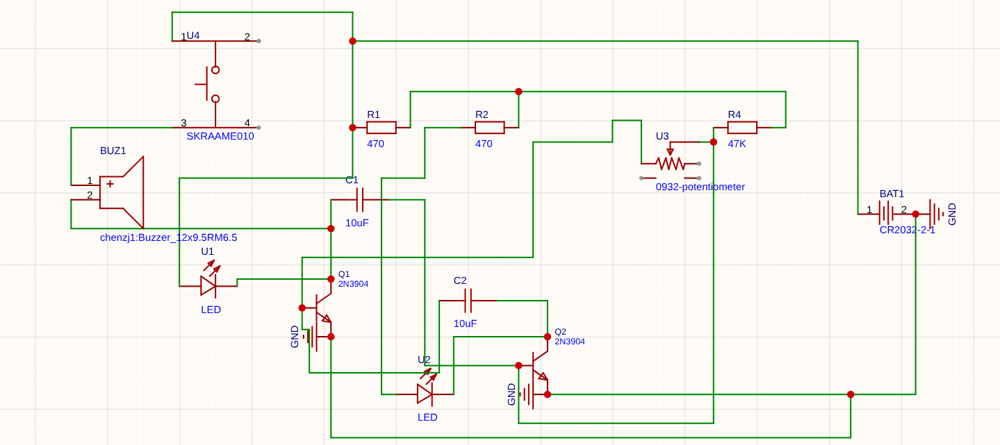
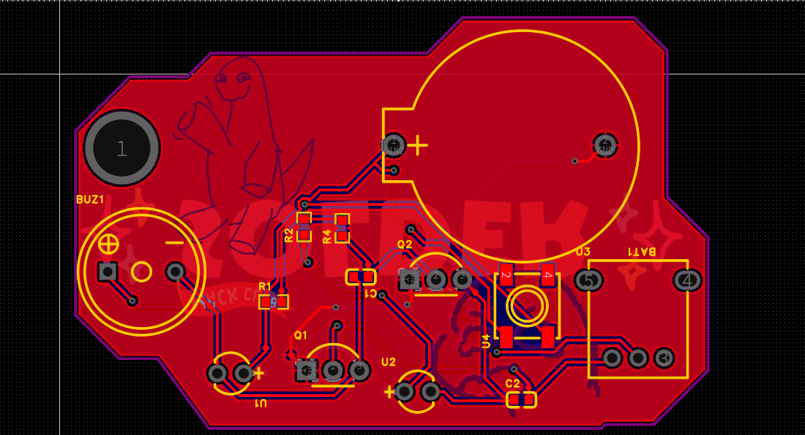
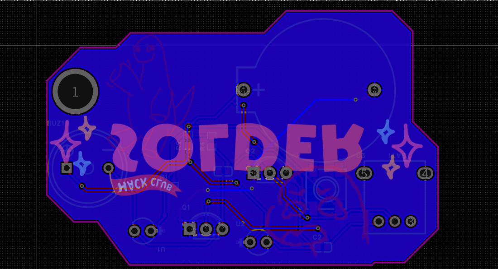

# Railboard-V1
## A PCB!
### A Hack Club that has a push button buzzer and 2 LED's to simulate a railroad crossing!

## Schematic

The schematic is a somewhat simple loop that links power to the first resistor and then it continues to power the following. The push button is connected to the start of the power link so it doesn't stop power and goes directly to the buzzer. The LED's are linked to resistors and transistors and then connected to GND. 
## PCB

The PCB is a detailed shape with art I added and uses the JLCPCB full-color silkscreen tech! The layout was somewhat hard and the DRC was taken into consideration!

BOM is under the production folder or look below for a less detailed BOM:

| Product | Quantity |
| --- | --- |
| `LED` | 2x (any colors make sure they are **5MM!**) |
| `Resistors` | 3x (2 470Ω, 1 47kΩ) |
| `Transistors` | 2x (2N3904) |
| `Mini motor disk/buzzer` | 1x (any kind with SMD 2 pin mount) |
| `Capacitors` | 2x (10uF) |
| `Push Button` | 1x (CR2032 batt holder) |
