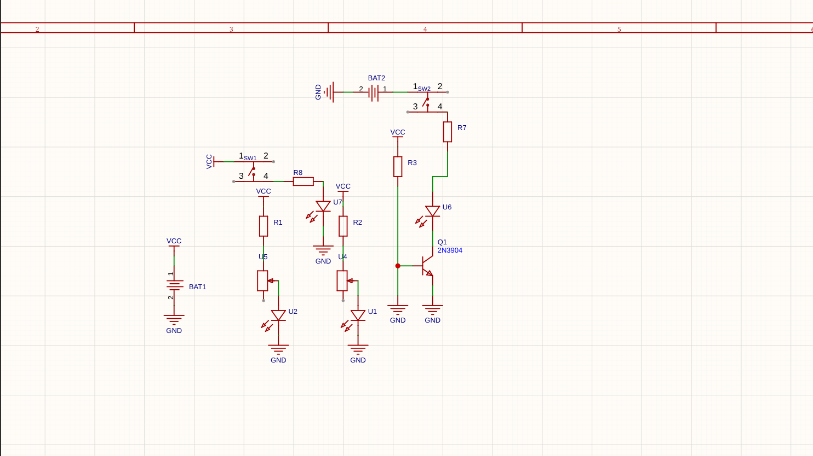
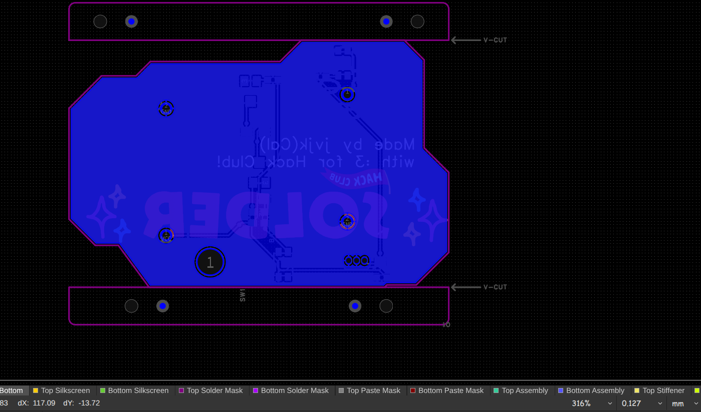
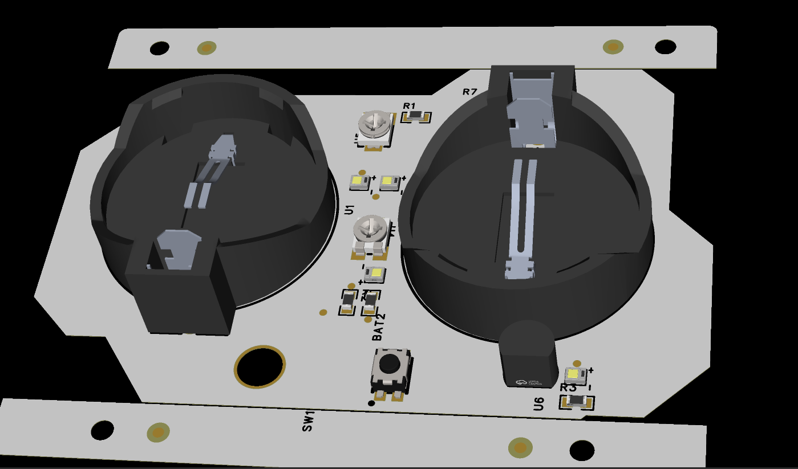

# Railboard-V1
## A PCB!
### A Hack Club that has a few LED's, 2 potentiometers, and 2 push switches to simulate a railroad crossing!

## Schematic

The schematic is a somewhat simple loop that links power to the first resistor and then it continues to power the following. The push button is connected to the start of the power link so it doesn't stop power and goes directly to the other LED's. The LED's are linked to resistors and their respective power and control sources and then connected to GND. 
## PCB

The PCB is a detailed shape with art I added and uses the JLCPCB full-color silkscreen tech! The layout was somewhat hard and the DRC was taken into consideration!

BOM is under the production folder or look below for a less detailed BOM:

| Product | Quantity |
| --- | --- |
| `LED` | 2x (any colors make sure they are **5MM!**) |
| `Resistors` | 3x (2 470Ω, 1 47kΩ) |
| `Push Button` | 1x (CR2032 batt holder) |

 
Made by JVJK with :3 for Hack Club! Slack: Java Junkie
